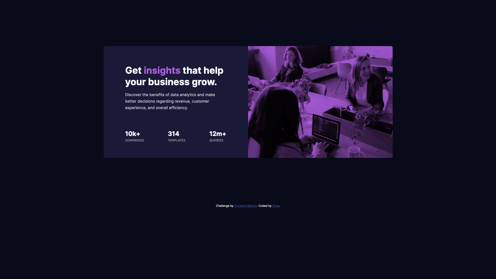
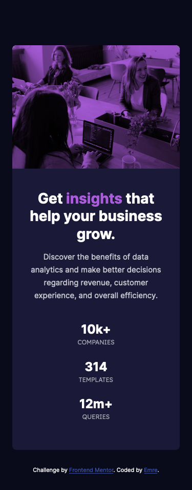

# Frontend Mentor - Stats preview card component solution

This is a solution to the [Stats preview card component challenge on Frontend Mentor](https://www.frontendmentor.io/challenges/stats-preview-card-component-8JqbgoU62). Frontend Mentor challenges help you improve your coding skills by building realistic projects.

## Table of contents

- [Frontend Mentor - Stats preview card component solution](#frontend-mentor---stats-preview-card-component-solution)
  - [Table of contents](#table-of-contents)
  - [Overview](#overview)
    - [The challenge](#the-challenge)
    - [Screenshot](#screenshot)
    - [Links](#links)
  - [My process](#my-process)
    - [Built with](#built-with)
    - [What I learned](#what-i-learned)
  - [Author](#author)

## Overview

### The challenge

Users should be able to:

- View the optimal layout depending on their device's screen size

### Screenshot

### Links

- Solution URL: [https://www.frontendmentor.io/solutions/stats-preview-card-component-with-sass-and-semantic-html-joVRkrNVa](https://www.frontendmentor.io/solutions/stats-preview-card-component-with-sass-and-semantic-html-joVRkrNVa)
- Live Site URL: [https://emreyyz.github.io/frontendmentor-002/](https://emreyyz.github.io/frontendmentor-002/)

## My process

### Built with

- Semantic HTML5 markup
- SCSS
- Flexbox
- CSS Grid
- Mobile-first workflow

### What I learned

I have lost a lot of time trying to fix some margin errors. I now know the value of browser styling resetters like "reset.css". I will definitely use it on my projects going forward.

## Author

- Website - [Emre C. Aydin](https://emre.ca)
- Frontend Mentor - [@EmreYYZ](https://www.frontendmentor.io/profile/EmreYYZ)
- Twitter - [@MostlyEmre](https://twitter.com/MostlyEmre)
